# Scheiss Intel RST VMD Controller

Was ist das überhaupt Intel RST VMD...  
Irgendein Scheiß wo sich der Intel CPU vor dem Controller schaltet und selbst die Steuerung der NVME übernimmt ...
Kann man wohl eigentlich im BIOS ausschalten, aber natürlich nicht in diesem billo HP BIOS, wohl auch eine Krankheit seit der 11. Gen von Intel

>Ist auch wie immer schön zu sehen, dass man, sobald man den Namen davon kennt, auch vernünftige Google Ergebnisse bekommt ...

- **[Bei Geräten mit Intel CPUs der 11. Gen werden bei der Installation von Windows 11/10 keine Laufwerke gefunden](https://www.asus.com/de/support/FAQ/1044458/)**
- **[Das Laufwerk kann bei der Installation eines neuen Windows* BS auf Plattformen der 11. Generation nicht erkannt werden](https://www.intel.de/content/www/de/de/support/articles/000058724/memory-and-storage/intel-optane-memory.html)**

## Meine Lösung
- Treiber extrahieren
- ``dism /online /export-driver /destination:<path>``
- Controller Treiber finden
- Controller Treiber laden
- (Shift + F10)
- diskpart clean
- Windows Installieren
- ``pnputil.exe /add-driver <pfad>\*.inf /subdirs /install``


## Anleitung
So sieht es am Anfang aus, bitte nicht von ``Laufwerk 0`` irritieren lassen, das ist eine externe Festplatte auf welchem die Treiber liegen, welche wir später benötigen.  
Aber wie man sieht, keine NVME SSD zu sehen ...
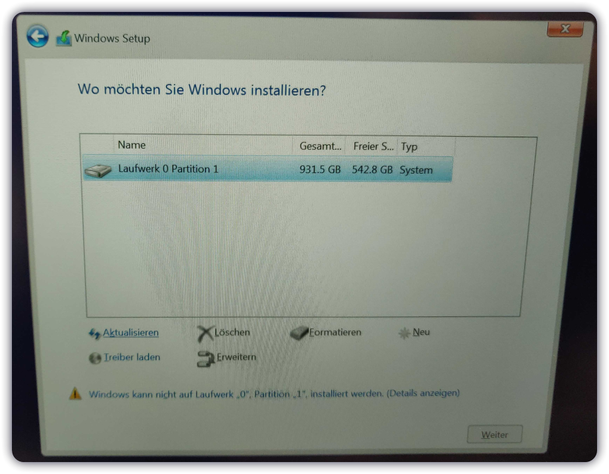

Rechner neu starten und auf dem vorinstallierten Windows 11 schauen, was als Speichercontroller angezeigt wird, weil die normalen Windows Treiber wohl nicht reichen.  
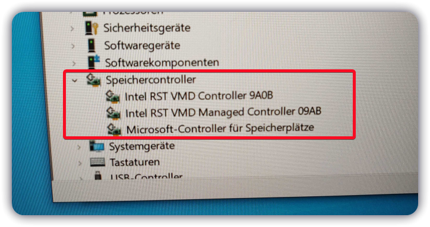

Über die Treiberdetails können wir sehen, welche Daten dafür benutzt werden bzw. welche wir gleich noch einmal separat benötigen.
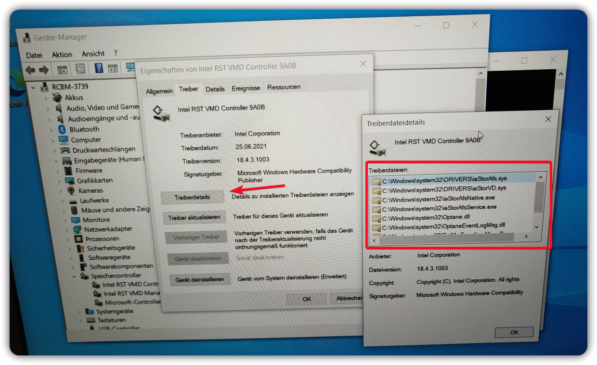

Das ganze könnten wir jetzt per Hand zusammensuchen oder einfach alle Treiber extrahieren
````batch
dism /online /export-driver /destination:<path>

Example:
dism /online /export-driver /destination:C:\extra-driver

````
Dort sind jetzt alle Treiber drin welche wir später benötigen, da ich Probleme bekommen hatte, als ich versuchte diese während der Installation zu importieren, habe ich dann hier den benötigten **Intel RST VMD Controller 9A0B** noch einmal separat abgelegt.

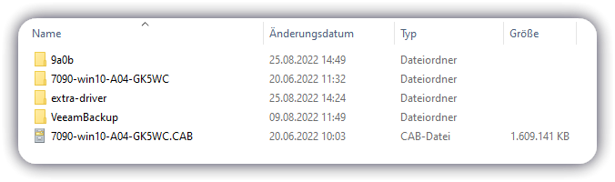

---
Neuer Versuch, mit allen Treibern und den Controller Treiber separat wieder in die Betriebsinstallation, diesmal kommt ``Laufwerk 0`` auch zum Einsatz, dies ist ja unsere externe Festplatte wo alle Treiber drauf liegen.
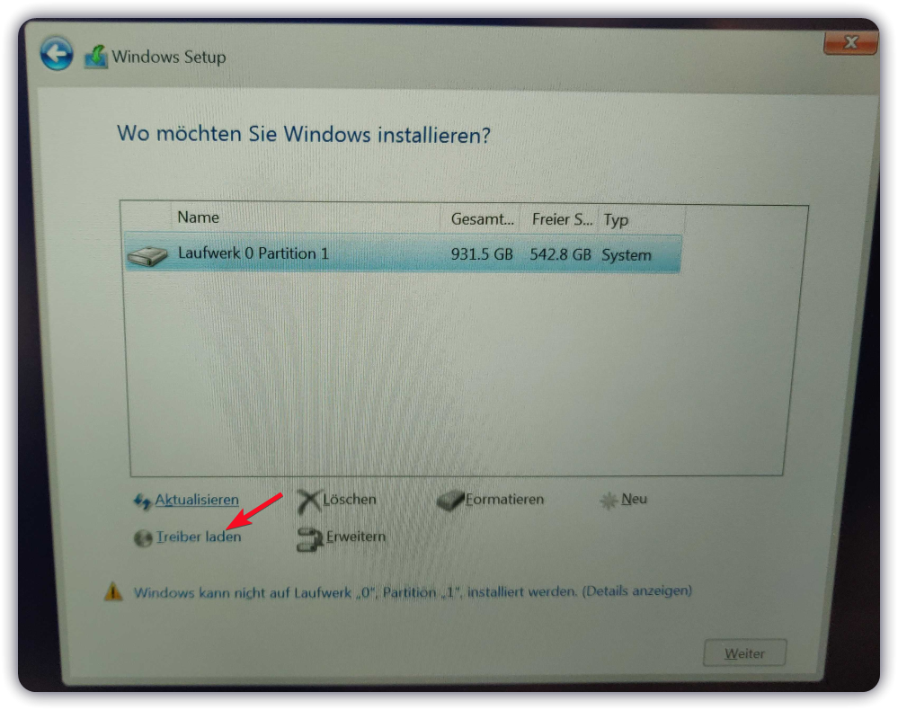

Denn wenn wir nun über Treiber laden in den Ordner mit den Dateien des **VMD Controller 9A0B** gehen, können wir hier direkt den benötigten Treiber installieren.

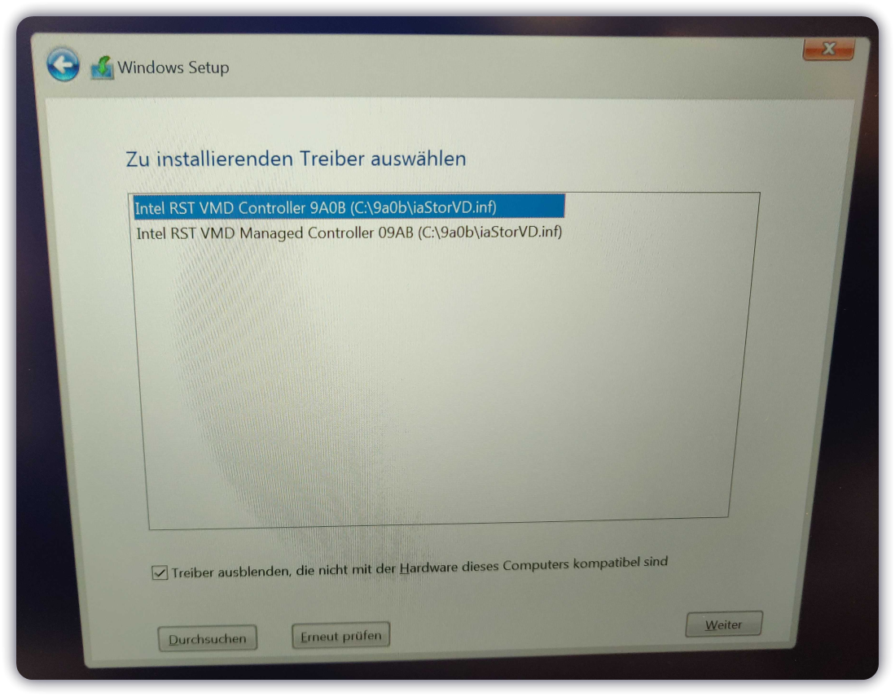
Jetzt sind alle Laufwerke bzw. die fehlende NVME SSD sichtbar + deren Partitionen, diese müssen wir jetzt noch löschen, da es auch hier Probleme gab und die Installation abgestürzt ist, beim versuch es über die untere Oberfläche zu machen, weichen wir hier auf ``diskpart`` aus.
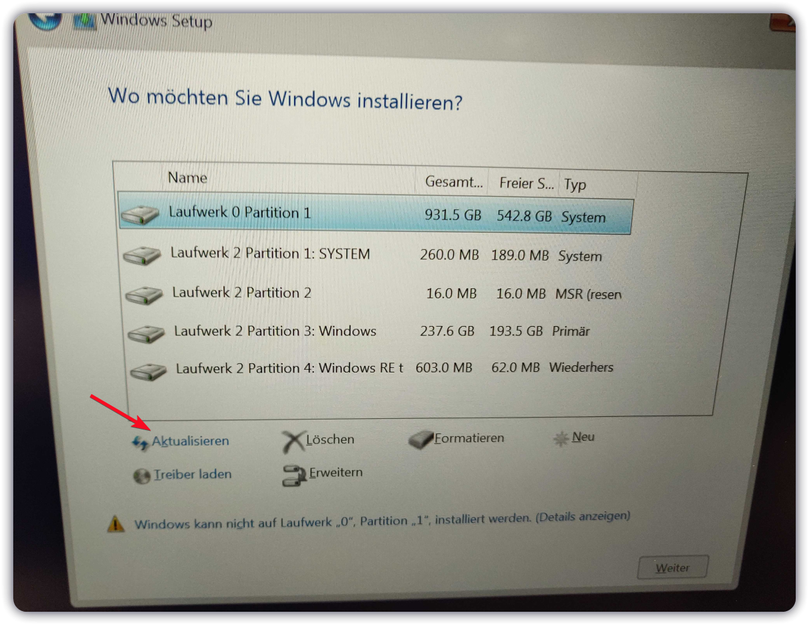
Dazu einfach Shift + F10 drücken und es öffnet sich die bekannte CMD, hier öffnen wir soeben ``diskpart``.  
**Bitte hier achten, die richtige Disk zu erwischen und nicht aus Versehen die externe Festplatte oder den USB-Stick zu löschen!**
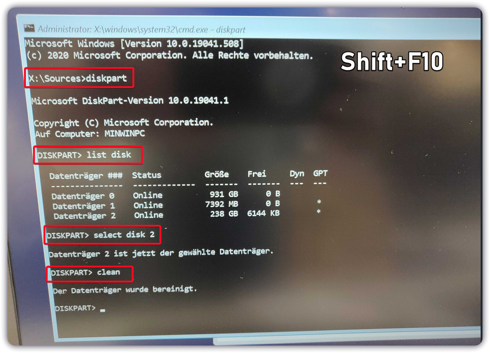
Nun können wir einfach mit der Installation wie gewohnt fortfahren.
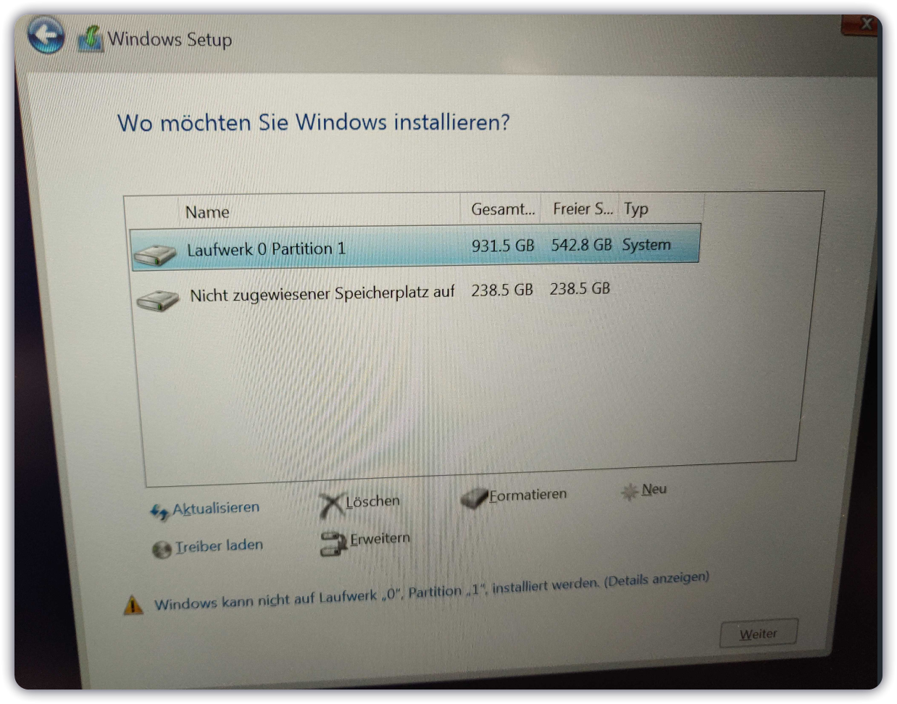

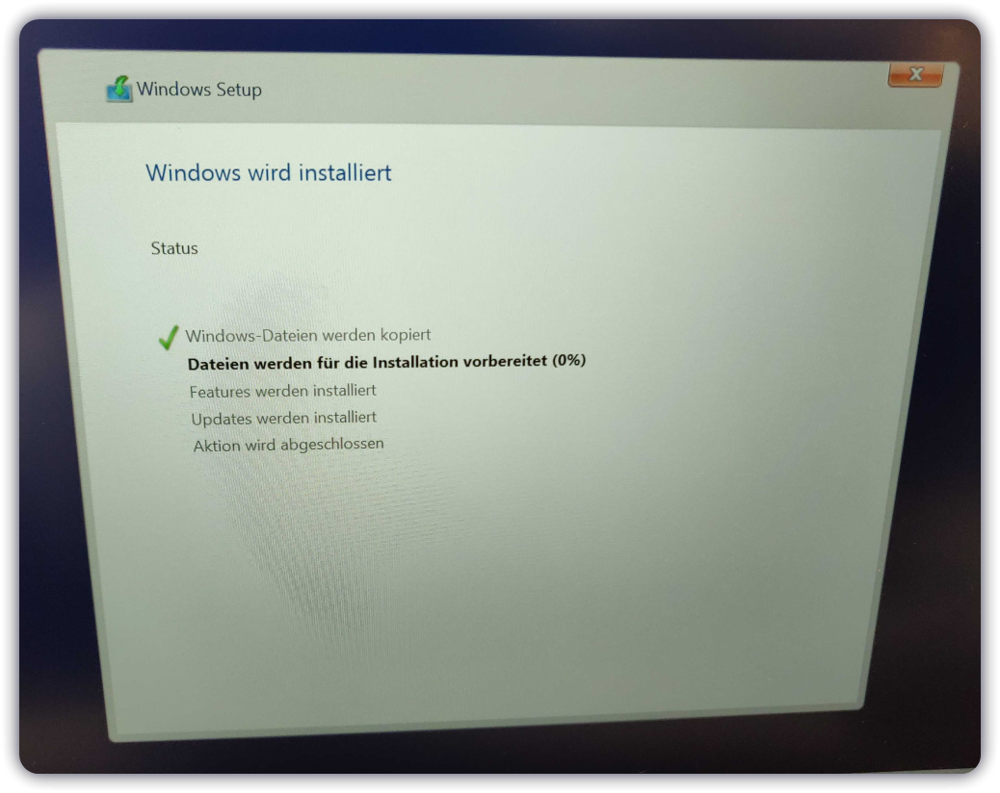

---

  Als Letztes lohnt es sich noch die weiteren Treiber zu installieren, damit z.B. das Touchpad, Sound, Ethernet etc. funktioniert, da unsere externe Festplatte immer noch angeschlossen ist, wird diese in meinem Fall jetzt unter ``D:`` von Windows automatisch gemountet.

````batch
pnputil.exe /add-driver <pfad>\*.inf /subdirs /install

pnputil.exe /add-driver D:\extra-driver\*.inf /subdirs /install
````

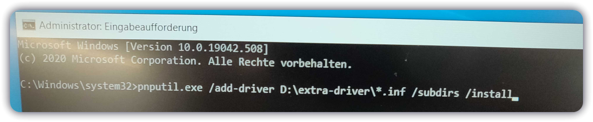

Nach einem letzten Neustart sollten jetzt alle Treiber installiert sein, von hier an kann man wie gewohnt weitermachen.

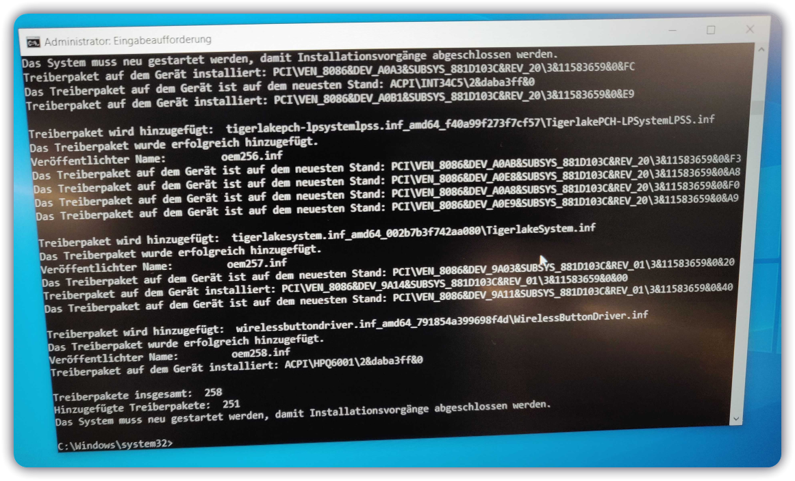
