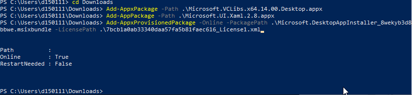

# winget
## Prerequisites
- [Winget-cli Manually Update](https://github.com/microsoft/winget-cli#manually-update)

````
Windows cannot install package Microsoft.DesktopAppInstaller_1.3.2691.0_x64__8wekyb3d8bbwe because this package depends on a framework that could not be found. Provide the framework
"Microsoft.UI.Xaml.2.7" published by "CN=Microsoft Corporation, O=Microsoft Corporation, L=Redmond, S=Washington, C=US", with neutral or x64 processor architecture and minimum version
````

## **Desktop framework** (Not sure if needed?)
- [Download Framework](https://learn.microsoft.com/en-gb/troubleshoot/developer/visualstudio/cpp/libraries/c-runtime-packages-desktop-bridge#how-to-install-and-update-desktop-framework-packages)


``Add-AppxPackage -Path .\Microsoft.VCLibs.x64.14.00.Desktop.appx``


YourPhone killen


Ist aber gar nicht aktiv?

``Get-AppxPackage -AllUsers | Format-List -Property PackageFullName,PackageUserInformation``

Okay hier taucht es auf...

``Get-AppxPackage -AllUsers -Name "*Your*"``

``Remove-AppxPackage -Package Microsoft.YourPhone_1.22072.207.0_x64__8wekyb3d8bbwe``

``Add-AppxPackage -Path .\Microsoft.VCLibs.x64.14.00.Desktop.appx``

Okay hat funktioniert.

## **Microsoft UI Xaml**
Next level AIDS missing dependency
https://github.com/microsoft/winget-cli/issues/1861 

- [Download Microsoft.UI.XAML](https://www.nuget.org/packages/Microsoft.UI.Xaml/)


``Add-AppPackage -Path .\Microsoft.UI.Xaml.2.8.appx``


## **Winget-CLI**
- [Download Winget-CLI](https://github.com/microsoft/winget-cli/releases)


``Add-AppxProvisionedPackage -Online -PackagePath .\Microsoft.DesktopAppInstaller_8wekyb3d8bbwe.msixbundle -LicensePath .\7bcb1a0ab33340daa57fa5b81faec616_License1.xml``


- [Winget Install Parameter](https://learn.microsoft.com/en-us/windows/package-manager/winget/install)
- [winstall RustDesk](https://winstall.app/apps/RustDesk.RustDesk)

``winget install --id=RustDesk.RustDesk  -e``


