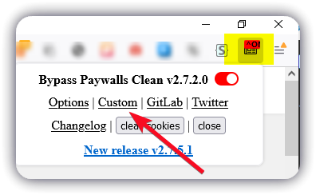

# Aachener Zeitung Unlock

>Aachner Zeitung lesen ohne Abo? Kein Problem!

Vorraussetzungen:

- Firefox (Chrome, Android auch möglich beschränke mich hier aber auf FF)
- https://addons.mozilla.org/de/firefox/addon/bypass-paywalls-clean/

Nach der Installation muss man für die Aachener Zeitung noch eine eigene Regel erstellen.




Unten im Bereich Json file, dann folgende Regel hinzufügen und speichern.
````
{"Aachen":{"domain":"aachener-zeitung.de","block_javascript":1,"block_javascript_ext":1,"useragent":"googlebot","random_ip":"eu"}}
````

**Fertig**

Jetzt kann man schon das ganze Angebot ohne Abo nutzen.  
Falls es zu Problemen mit der Darstellung kommt, ruhig mal die Seite mit F5 neuladen und darauf achten das hier oben das Addon eingeschaltet ist.


